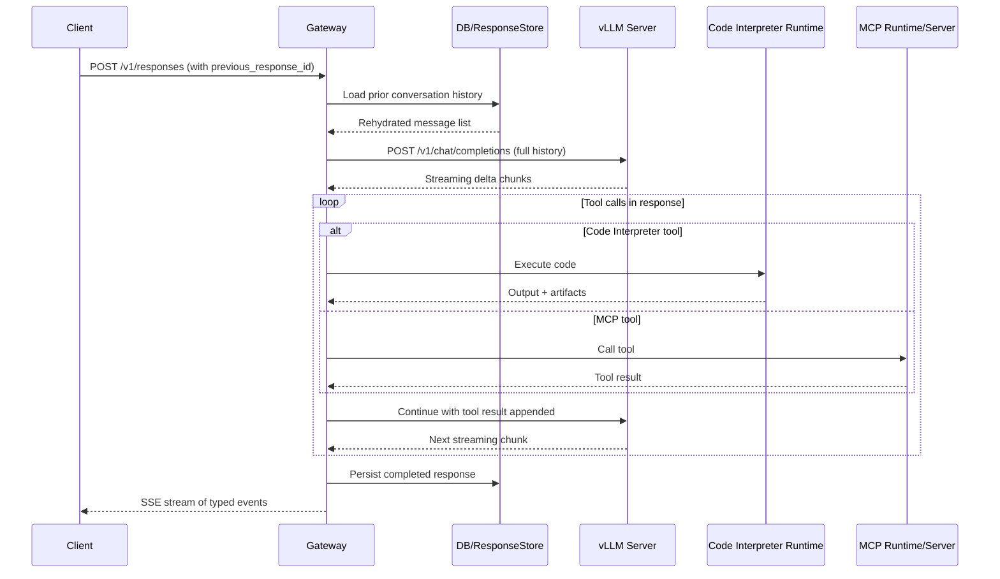

# RFC-A — System Architecture & Stateful Conversation Memory

> **Status:** Draft — open for community feedback
> **Covers:** Overall system design, package layering, stateful response storage, and the protocol translation problem
> **Relates to:** RFC-B (tool runtimes), RFC-C (config, MCP, observability)

---

## Table of Contents

1. [Overview](#1-overview)
2. [Goals and Non-Goals](#2-goals-and-non-goals)
3. [System Overview](#3-system-overview)
4. [Proposed Package Layers](#4-proposed-package-layers)
5. [Layer Dependency Rules](#5-layer-dependency-rules)
6. [Stateful Conversation Memory](#6-stateful-conversation-memory)
7. [Response Store Infrastructure](#7-response-store-infrastructure)
8. [Protocol Translation](#8-protocol-translation)
9. [The Three-Stage Event Pipeline](#9-the-three-stage-event-pipeline)
10. [Stream Paths and Failure Handling](#10-stream-paths-and-failure-handling)
11. [Open Questions](#11-open-questions)

---

## 1. Overview

This RFC describes the foundational architecture of **agentic-stack**: an open-source gateway that adapts a stateless LLM inference backend (any Chat Completions-compatible server) into a stateful, tool-capable Responses API endpoint.

The core challenges the system must address are:

1. **Statefulness.** Chat Completions requires the client to send full conversation history on every request. The Responses API allows the client to send only new input and reference a prior response by ID. The gateway must bridge this gap.
2. **Protocol translation.** The upstream server produces stateless delta chunks. Clients expect typed, sequenced SSE events with stable item IDs and lifecycle events per output item type.
3. **Tool execution.** Built-in tools (code interpreter, web search) and MCP tools must be executed by the gateway mid-request, invisibly to the client.

We propose a six-layer package structure, a single-table response store, and a three-stage event pipeline to address these challenges. All of these are proposals — we welcome community feedback before settling on any of them.

---

## 2. Goals and Non-Goals

**Goals:**

- Provide a clear conceptual map that contributors can use to orient themselves quickly.
- Keep each layer's responsibilities narrow and independently testable.
- Maintain an acyclic dependency graph between layers.
- Make it straightforward to swap out individual subsystems (store backend, HTTP framework, tool runtimes) without rewriting unrelated code.

**Non-Goals (for this RFC):**

- Specifying concrete class names, file paths, or framework choices. Those details belong in implementation PRs.
- Prescribing a plugin architecture. That may be appropriate in a later phase but is out of scope for the MVP.

---

## 3. System Overview

The system sits between client applications and a Chat Completions-compatible upstream LLM server. It adds statefulness, tool execution, and Responses API protocol compliance on top of whatever inference backend the operator points it at.



A few notes on this diagram:

- The "Gateway" represents the HTTP routing and core orchestration layers acting together.
- The tool call loop may iterate multiple times if the model produces sequential tool calls.
- The SSE stream to the client is interleaved with the tool loop — events are emitted in real time, not buffered until the response is complete.
- The "vLLM Server" participant represents any Chat Completions-compatible upstream; it does not have to be vLLM specifically.

---

## 4. Proposed Package Layers

We propose organizing the project into six conceptual layers. The names below are working titles — we welcome suggestions for clearer names.

| # | Layer | Responsibility |
|---|-------|---------------|
| 1 | **Entry Points** | Process startup, signal handling, integration with the chosen ASGI server or supervisor. These modules should be thin wrappers that assemble the application and hand control to the HTTP layer. |
| 2 | **HTTP Routing** | Route definitions, request parsing and validation, response serialization. Receives raw HTTP requests and produces structured objects for the orchestration layer. Owns the SSE streaming loop. |
| 3 | **Core Orchestration** | The central request lifecycle: history rehydration, upstream LLM calls, protocol translation, tool dispatch, and response persistence. The most complex logic lives here. |
| 4 | **Tool Runtimes** | Built-in tool implementations (code interpreter, web search). Each runtime should be self-contained with a well-defined interface: start, health-check, execute, shut down. |
| 5 | **MCP Integration** | Hosted and request-remote MCP server management, tool name mapping, and security enforcement. |
| 6 | **Config & Shared Foundations** | Immutable configuration, database connections, observability hooks, and any shared utilities. This layer must not depend on layers 1–5. |

---

## 5. Layer Dependency Rules

We propose the following dependency rules as documented conventions. Violations should be treated as bugs worth fixing.

```
Entry Points
    └── may import from → HTTP Routing, Config & Shared Foundations

HTTP Routing
    └── may import from → Core Orchestration, Config & Shared Foundations

Core Orchestration
    └── may import from → Tool Runtimes, MCP Integration, Config & Shared Foundations

Tool Runtimes
    └── may import from → Config & Shared Foundations

MCP Integration
    └── may import from → Config & Shared Foundations

Config & Shared Foundations
    └── may import from → (nothing within this project)
```

Key rules:

- **No upward imports.** A lower layer must never import from a higher layer.
- **No cross-sibling imports.** Tool Runtimes and MCP Integration must not import each other; both are coordinated by Core Orchestration.
- **Entry points are thin.** Layer 1 should contain almost no business logic.
- **Foundations are a leaf.** If a utility function appears to need something from a higher layer, that is a signal to rethink the abstraction.

---

## 6. Stateful Conversation Memory

### 6.1 The Problem

Standard Chat Completions requires the client to send the entire conversation history on every request. The Responses API solves this with a single field: `previous_response_id`. The gateway must store enough state after each response to fully reconstruct the conversation for the next turn.

```
Turn 1:  client sends { input: "My name is Alice." }
         gateway returns { id: "resp_abc123", output: [...] }

Turn 2:  client sends { previous_response_id: "resp_abc123",
                        input: "What is my name?" }
         gateway reconstructs full history internally
         client sends ONLY the new message
```

### 6.2 What Gets Stored

We propose persisting a payload containing everything needed to continue the conversation. For the MVP, we suggest storing at minimum:

```
Stored Payload
├── schema_version         integer — governs backward compatibility
├── full input history     the complete message list sent to the upstream LLM
├── model output           all output items produced (text, tool calls, reasoning)
├── active tools           tools that were enabled for this turn
├── tool choice            the tool_choice setting active in this turn
└── system instructions    any system prompt active in this turn
```

Tools, tool choice, and system instructions are stored alongside the response so the next turn can inherit them if the client omits them.

### 6.3 The Rehydration Rule

When `previous_response_id` is present, we propose assembling the full history using:

```
full_history_for_llm =
    stored.full_input_history        ← everything the LLM saw in the previous turn
  + stored.model_output              ← what the LLM produced in the previous turn
  + new_input                        ← what the client is sending now
```

Because each stored `full_input_history` already contains all prior turns flattened, a lookup is always a single database read — there is no recursive chain traversal at request time.

```
┌─────────────────────────────────────────────────────────────────┐
│  Turn 1                                                         │
│  new_input:            ["Hi, I'm Alice"]                        │
│  sent to LLM:          ["Hi, I'm Alice"]                        │
│  stored input history: ["Hi, I'm Alice"]                        │
│  stored output:        ["Hello Alice!"]                         │
├─────────────────────────────────────────────────────────────────┤
│  Turn 2  (previous_response_id = turn 1)                        │
│  new_input:   ["What is my name?"]                              │
│  sent to LLM: ["Hi, I'm Alice",                                 │
│                "Hello Alice!",          ← from stored output    │
│                "What is my name?"]      ← new input             │
│  stored input history: [all 3 messages]                         │
│  stored output:        ["Your name is Alice."]                  │
├─────────────────────────────────────────────────────────────────┤
│  Turn 3  (previous_response_id = turn 2)                        │
│  new_input:   ["Say it again"]                                  │
│  sent to LLM: ["Hi, I'm Alice",                                 │
│                "Hello Alice!",                                   │
│                "What is my name?",                               │
│                "Your name is Alice.",   ← from stored output    │
│                "Say it again"]          ← new input             │
└─────────────────────────────────────────────────────────────────┘
```

### 6.4 What Is and Is Not Stored

```
┌──────────────────────────────────────────────┬──────────┐
│  Condition                                   │  Stored? │
├──────────────────────────────────────────────┼──────────┤
│  status = "completed"  AND  store = true     │  Yes     │
│  status = "incomplete" AND  store = true     │  Yes     │
│  status = "failed"                           │  No      │
│  store = false  (any status)                 │  No      │
└──────────────────────────────────────────────┴──────────┘
```

`store=false` is a client-controlled opt-out. Failed responses are never stored — a client cannot chain off a response that errored.

### 6.5 Full Read/Write Flow

```
POST /v1/responses
    │
    ▼
Request Orchestrator
    │
    ├── 1. Load stored payload from store (if previous_response_id present)
    │        Redis (if enabled) → Database
    │
    ├── 2. Assemble full history using rehydration rule
    │
    ├── 3. Send to upstream LLM (Chat Completions)
    │        stream delta chunks through the event pipeline
    │
    ├── 4. Stream translated SSE events to client (real-time)
    │
    └── 5. On response.completed: persist payload to store
             Database write + Redis write-through (if enabled)
```

Steps 4 and 5 happen concurrently in streaming mode — the store write is triggered by intercepting the terminal event in the same async generator that is being streamed to the client.

---

## 7. Response Store Infrastructure

### 7.1 Schema Proposal

We propose a single-table design. The full response payload lives in a single JSON column to keep the schema stable as the payload evolves. Indexed metadata columns allow efficient lookups by response ID and creation time.

```
Table: response_store (proposed name — open to suggestions)

┌─────────────────────┬──────────────────────────────────────────────┐
│  Column             │  Notes                                       │
├─────────────────────┼──────────────────────────────────────────────┤
│  response_id        │  Primary key (UUID string)                   │
│  previous_resp_id   │  Foreign key reference — nullable, indexed   │
│  model              │  Model name string                           │
│  created_at         │  Timezone-aware datetime — indexed           │
│  expires_at         │  Nullable TTL expiry — indexed               │
│  store              │  Boolean — was store=true on the request?    │
│  schema_version     │  Integer — payload contract version          │
│  payload            │  JSON blob (SQLite TEXT / PostgreSQL JSONB)  │
└─────────────────────┴──────────────────────────────────────────────┘
```

The `schema_version` column is bumped whenever the payload shape changes in a breaking way. Old rows with lower versions either receive an upgrader or require a store clear, documented per version.

### 7.2 Storage Backends

We propose supporting two backends:

```
┌────────────────┬──────────────────────────────────────────────────┐
│  Backend       │  Recommended use                                 │
├────────────────┼──────────────────────────────────────────────────┤
│  SQLite        │  Development, single-machine, zero-config        │
├────────────────┼──────────────────────────────────────────────────┤
│  PostgreSQL    │  Production, multi-worker, multi-instance        │
└────────────────┴──────────────────────────────────────────────────┘
```

SQLite would be the default — no configuration needed to get started. PostgreSQL would be activated by pointing the database URL configuration at a PostgreSQL connection string.

### 7.3 Connection Factory

One approach is a dedicated module responsible only for engine creation and connection-level tuning, deliberately knowing nothing about the schema or store logic. For SQLite we suggest applying WAL mode, a busy timeout, and foreign key enforcement on every new connection. For PostgreSQL, given that the gateway may run as multiple worker processes, we suggest a no-persistent-pool approach so each query opens and closes its own connection, avoiding `N workers × pool_size` open database connections.

### 7.4 Schema Initialization Safety

Schema creation must run safely even when multiple worker processes start simultaneously. One approach:

- **SQLite:** run schema initialization in the supervisor process before workers fork. Workers receive a signal (e.g. an environment variable) that schema is ready and skip re-initialization.
- **PostgreSQL:** use a database-level advisory lock. The first instance to acquire it runs the DDL and releases it; others wait with a reasonable timeout.

We welcome community input on whether there are simpler or more portable approaches.

### 7.5 Optional Redis Hot Cache

For multi-worker deployments, `previous_response_id` lookups hit the database on every request. We propose an optional Redis cache to reduce database reads for recently active conversations:

```
Read path (with Redis enabled):

   Check Redis ──► HIT  → return cached entry
               └─ MISS → query Database → write-through to Redis

Read path (without Redis):

   Query Database → return result
```

The cache key should include the schema version so that when `schema_version` is bumped, old cache entries are automatically orphaned — no explicit invalidation needed.

Cache failures should be silently swallowed so that a Redis outage degrades gracefully to database-only reads rather than breaking the gateway entirely.

---

## 8. Protocol Translation

### 8.1 The Translation Problem

The upstream LLM server speaks Chat Completions. Clients expect the Responses API. These are fundamentally different protocols:

```
┌─────────────────────────────┬──────────────────────────────────────┐
│  Chat Completions           │  Responses API                       │
├─────────────────────────────┼──────────────────────────────────────┤
│  Stateless — client sends   │  Stateful — client sends only new    │
│  full history every time    │  input + previous_response_id        │
├─────────────────────────────┼──────────────────────────────────────┤
│  Delta chunks, finish_reason│  Typed SSE events with sequence      │
│  No stable item IDs         │  numbers and stable item IDs         │
├─────────────────────────────┼──────────────────────────────────────┤
│  Tool calls: function name  │  Tool calls: typed output items      │
│  + JSON args as one chunk   │  with lifecycle events (started,     │
│                             │  delta, done, interpreting, ...)     │
├─────────────────────────────┼──────────────────────────────────────┤
│  Reasoning: no standard     │  Reasoning: dedicated output item    │
│  representation             │  with delta/done events              │
└─────────────────────────────┴──────────────────────────────────────┘
```

The gateway bridges this gap entirely in software, without touching the upstream server.

### 8.2 HTTP Layer

We propose two routes:

```
POST /v1/responses      — create a new response (stream or non-stream)
GET  /v1/responses/{id} — retrieve a previously stored response
```

For the `POST` route, we suggest awaiting the first event before opening the HTTP streaming response. This ensures that immediate validation errors (e.g. unknown `previous_response_id`) surface as proper HTTP 4xx responses rather than being buried inside a 200 SSE stream.

### 8.3 Request Orchestrator

The orchestrator is the central coordinator for one full request lifecycle. It should:

1. Rehydrate conversation history from the store (Section 6).
2. Resolve which tools are active for this request (built-in tools, MCP tools, user-defined function tools).
3. Invoke the upstream LLM with the assembled history.
4. Feed upstream events through the three-stage event pipeline (Section 9).
5. Coordinate tool execution mid-stream when the model requests a tool.
6. Persist the completed response to the store.

One instance of the orchestrator is created per request. It should hold no mutable state that outlives the request.

---

## 9. The Three-Stage Event Pipeline

### 9.1 Design Rationale

We propose a three-stage pipeline with a framework-neutral intermediate representation sitting between the LLM framework layer and the wire-format layer. Neither end knows about the other:

```
  LLM framework events           Internal representation           Wire format
  (framework-specific)           (framework-neutral)              (Responses API)
        │                                │                               │
        │   framework events      ────►  │  intermediate events  ────►  │  SSE events
        │                                │  (typed value objects)        │  "data:{...}\n\n"
        │                                │                               │
   Normalizer                   Internal event types              Composer + SSE Encoder
   (Stage 1)                    (Stage 2 boundary)                (Stages 2 & 3)
```

The benefit of this design is that swapping the LLM framework (Stage 1) or the wire format (Stage 3) does not require changing the other. We acknowledge this adds abstraction cost and welcome feedback on whether a simpler two-stage approach would be preferable for the MVP.

### 9.2 Stage 1 — Normalizer

The Normalizer translates framework-specific streaming events into intermediate typed events. It is the only component that knows about the LLM framework internals.

It should handle at minimum the following event categories:

| Source event type | Intermediate event emitted |
|-------------------|---------------------------|
| Text token started | Message started |
| Text token delta | Message delta |
| Text token done | Message done |
| Reasoning token started | Reasoning started |
| Reasoning token delta | Reasoning delta |
| Reasoning token done | Reasoning done |
| Tool call started (built-in: code interpreter) | Code interpreter call started |
| Tool call delta (code content) | Code interpreter code delta |
| Tool call done (code content) | Code interpreter code done |
| Tool execution begun | Code interpreter interpreting |
| Tool result received (code interpreter) | Code interpreter call completed |
| Tool call started (web search) | Web search call started |
| Tool execution begun (web search) | Web search searching |
| Tool result received (web search) | Web search call completed |
| Tool call started (MCP) | MCP call started |
| Tool call delta (MCP arguments) | MCP call arguments delta |
| Tool call done (MCP arguments) | MCP call arguments done |
| Tool result received (MCP, success) | MCP call completed |
| Tool result received (MCP, error) | MCP call failed |
| User-defined function call started | Function call started |
| User-defined function call delta | Function call arguments delta |
| User-defined function call done | Function call done |
| Run completed | Usage final |

**Special case — code argument streaming.** Upstream LLMs typically send code arguments inside a JSON fragment (e.g. `{"code": "print(1)"}`). The Responses API spec expects raw code text as the delta. The Normalizer should extract the string value of the code key incrementally from the byte stream without buffering the full JSON, enabling real-time code streaming.

### 9.3 Stage 2 — Composer

The Composer translates intermediate events into typed Responses API SSE objects. It is the only component that knows the Responses API wire format.

Per request, the Composer maintains:

- A monotonically increasing sequence number, allocated per SSE event emitted.
- A monotonically increasing output index, one per output item added.
- An accumulation map from item key to in-progress item state (text, code, arguments).
- An ordered list of completed output items, assembled into `response.output` at completion.

**Item IDs.** We propose that each output item receive a unique stable ID of the form `{type_prefix}{uuid}`. Using a type-specific prefix makes IDs human-readable and self-describing. For example, message output items might use one prefix, reasoning items another, code interpreter call items another, and so on. The exact prefix values are an implementation detail.

The full mapping from intermediate events to SSE event types is:

```
Intermediate Event               →   SSE event type(s) emitted
──────────────────────────────────────────────────────────────────────────────
MessageStarted                   →   response.output_item.added
                                     response.content_part.added
MessageDelta                     →   response.output_text.delta
MessageDone                      →   response.output_text.done
                                     response.content_part.done
                                     response.output_item.done

ReasoningStarted                 →   response.output_item.added
                                     response.output_item.done  (emitted early
                                       for spec parity — item marked done before
                                       reasoning deltas stream)
ReasoningDelta                   →   response.reasoning.delta
ReasoningDone                    →   response.reasoning.done

FunctionCallStarted              →   response.output_item.added
FunctionCallArgumentsDelta       →   response.function_call_arguments.delta
FunctionCallDone                 →   response.function_call_arguments.done
                                     response.output_item.done

CodeInterpreterCallStarted       →   response.output_item.added
                                     response.code_interpreter_call.in_progress
CodeInterpreterCallCodeDelta     →   response.code_interpreter_call_code.delta
CodeInterpreterCallCodeDone      →   response.code_interpreter_call_code.done
CodeInterpreterCallInterpreting  →   response.code_interpreter_call.interpreting
CodeInterpreterCallCompleted     →   response.code_interpreter_call.completed
                                     response.output_item.done

WebSearchCallStarted             →   response.output_item.added
                                     response.web_search_call.in_progress
WebSearchCallSearching           →   response.web_search_call.searching
WebSearchCallCompleted           →   response.web_search_call.completed
                                     response.output_item.done

McpCallStarted                   →   response.output_item.added
                                     response.mcp_call.in_progress
McpCallArgumentsDelta            →   response.mcp_call_arguments.delta
McpCallArgumentsDone             →   response.mcp_call_arguments.done
McpCallCompleted                 →   response.mcp_call.completed
                                     response.output_item.done
McpCallFailed                    →   response.mcp_call.failed
                                     response.output_item.done  (status: "failed")

UsageFinal                       →   response.completed
                                     (or response.incomplete if stopped early)
```

### 9.4 Stage 3 — SSE Encoder

The SSE Encoder serializes typed SSE objects to raw text frames for the HTTP response body:

```
Typed SSE object
      │
      │  serialize to JSON
      ▼
"data: {json}\n\n"
      │
      ▼  (on response.completed or response.failed)
"data: [DONE]\n\n"
```

**Defensive terminal marker.** If the upstream stream ends without emitting `response.completed` or `response.failed`, `[DONE]` should still be appended so clients are never left with a hanging stream.

**Spec note.** The real OpenAI Responses API does not emit `[DONE]`. We propose emitting it for [OpenResponses spec](https://www.openresponses.org/specification) compliance. This is a deliberate divergence and should be documented as such. We welcome feedback on whether this should be configurable.

---

## 10. Stream Paths and Failure Handling

### 10.1 Stream vs. Non-Stream Failure Behavior

The two request modes require different failure handling strategies:

```
┌──────────────────┬─────────────────────────────────────────────────────┐
│  Mode            │  Failure behavior                                   │
├──────────────────┼─────────────────────────────────────────────────────┤
│  Non-stream      │  Exception propagates out of the orchestrator.      │
│                  │  HTTP framework exception handler returns 4xx/5xx   │
│                  │  with a structured JSON error body.                 │
├──────────────────┼─────────────────────────────────────────────────────┤
│  Stream          │  Exception is caught inside the async generator.    │
│                  │  Emits  response.error  SSE event (structured)      │
│                  │  Emits  response.failed  (response.status="failed") │
│                  │  Appends  data: [DONE]                              │
│                  │  Client always gets a well-formed, closeable stream. │
└──────────────────┴─────────────────────────────────────────────────────┘
```

The stream path must never let an exception escape the generator. Once HTTP 200 has been sent, the only way to communicate failure to the client is through the event stream itself.

### 10.2 Failure Classification and Logging

We suggest a structured failure classification approach that, for any upstream error, extracts and logs:

- Error class and code
- Upstream HTTP status code (if applicable)
- Truncated error message (e.g. capped at 512 characters)
- How many tool call items were in flight at the time of failure
- How many MCP calls had failed within the request (hosted vs. request-remote)
- The raw upstream error body (truncated to a safe limit)

Log level should be based on error type: upstream 4xx responses suggest client error and warrant a WARNING; other failures warrant an ERROR.

The failure record should be assembled from counters that are updated on every intermediate event observed during the request, so the log always reflects a complete picture of what the orchestrator was doing at the moment of failure.

### 10.3 End-to-End Request Flow

```
  Client
    │  POST /v1/responses
    │  { model, input, tools, stream=true, previous_response_id? }
    ▼
  HTTP Routing Layer
    │  parse → validated request object
    │  await first event (so errors surface as HTTP errors, not SSE)
    ▼
  Request Orchestrator
    │  rehydrate history from store
    │  resolve tools → registered tool handles
    │  initialize Normalizer + Composer
    ▼
  Composer emits initial events:
    │  response.created
    │  response.in_progress
    ▼
  Upstream LLM call (Chat Completions streaming)
    │  tool loop: if LLM requests tool → execute → feed result back → continue
    ▼
  Normalizer processes each LLM framework event
    │  emits intermediate typed events
    ▼
  Composer processes each intermediate event
    │  emits typed SSE objects
    │  allocates item IDs, output indexes, sequence numbers
    ▼
  SSE Encoder
    │  serializes to "data: {...}\n\n" frames
    │  on terminal event: appends "data: [DONE]\n\n"
    ▼
  StreamingResponse → Client (real-time SSE frames)
    │
    │  (concurrently, via event interception)
    ▼
  Store write on response.completed / response.incomplete
    │  persist payload to database
    │  write-through to Redis cache (if enabled)
```

---

## 11. Open Questions

The following questions are left explicitly open for community discussion.

**On project structure:**

1. **Monorepo vs. multi-repo.** As the project matures, should tool runtimes or MCP integration be extracted into separately versioned packages?
2. **Language boundaries.** This RFC assumes a primary server language with a separate runtime process for the code interpreter (discussed in RFC-B). Is a two-language approach acceptable, or should there be a single-language constraint?
3. **Layer naming.** We welcome better names than "Core Orchestration" and "Config & Shared Foundations."
4. **Plugin architecture.** Should tool runtimes be loadable as plugins at runtime? A plugin architecture enables community extensions without forking, but adds complexity.
5. **Dependency enforcement.** What tooling, if any, should enforce layer dependency rules in CI?

**On stateful conversation memory:**

6. **Single-table vs. normalized schema.** All state lives in a single JSON column. This keeps the schema stable but makes it hard to query individual fields. Should we add indexed columns for common query fields in the MVP?
7. **TTL enforcement.** An `expires_at` column is proposed but there is no cleanup job specified. Should the MVP include a background TTL enforcement task, or explicitly defer this?
8. **`store=false` default.** Should `store=true` require an explicit opt-in to protect user privacy, or should storing be the default with an opt-out?
9. **Redis requirement.** Should Redis be recommended as a production requirement above a certain worker count threshold?

**On protocol translation:**

10. **Two-stage vs. three-stage pipeline.** Is the intermediate representation worth the abstraction cost for the MVP? A simpler two-stage approach would produce SSE objects directly from LLM framework events.
11. **Reasoning item lifecycle.** The spec emits `response.output_item.done` for reasoning before reasoning deltas stream (the item is marked done early). Should we replicate this behavior for parity, or wait until reasoning is truly complete?
12. **`[DONE]` configurability.** Should the `[DONE]` terminal marker be configurable per-request or per-deployment?
13. **First-chunk await overhead.** Awaiting the first chunk before returning the `StreamingResponse` adds latency to every streaming request. Is this trade-off acceptable?

---

**Next:** [RFC-B — Built-in Tools: Code Interpreter & Web Search](RFC-B_built_in_tools.md)
**See also:** [RFC-C — MCP Integration, Config, and Observability](RFC-C_mcp_config_observability.md)
