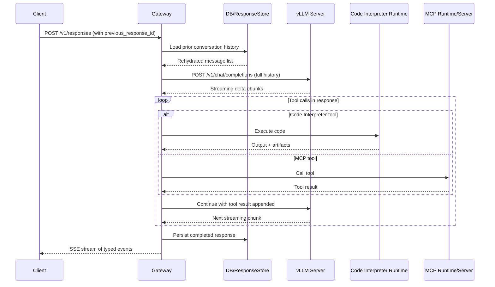

# RFC-01 — Project Structure
> **Status:** Draft — open for community review
> **Next:** [RFC-02-00 — ResponseStore: Storage Model & Rehydration](RFC-02-00_response_store_model.md)

---

## 1. Overview

This RFC describes the foundational architecture of **agentic-stack**: an open-source gateway that adapts a stateless LLM inference backend (any Chat Completions-compatible server) into a stateful, tool-capable Responses API endpoint.

The core challenges the system would need to address are:

1. **Statefulness.** Chat Completions requires the client to send full conversation history on every request. The Responses API allows the client to send only new input and reference a prior response by ID. The gateway would need to bridge this gap.
2. **Protocol translation.** The upstream server produces stateless delta chunks. Clients expect typed, sequenced SSE events with stable item IDs and lifecycle events per output item type.
3. **Tool execution.** Built-in tools (code interpreter, web search) and MCP tools would need to be executed by the gateway mid-request, invisibly to the client.

We propose a six-layer package structure, a single-table response store, and a three-stage event pipeline to address these challenges. All of these are proposals — we welcome community feedback before settling on any of them.

---

## 2. Goals and Non-Goals

**Goals:**

- Provide a clear conceptual map that contributors can use to orient themselves quickly.
- Keep each layer's responsibilities narrow and independently testable.
- Maintain an acyclic dependency graph between layers.
- Make it straightforward to swap out individual subsystems (store backend, HTTP framework, tool runtimes) without rewriting unrelated code.

**Non-Goals (for this RFC):**

- Specifying concrete class names, file paths, or framework choices. Those details belong in implementation PRs.
- Prescribing a plugin architecture. That may be appropriate in a later phase but is out of scope for the MVP.

---

## 3. System Overview

The system sits between client applications and a Chat Completions-compatible upstream LLM server. It adds statefulness, tool execution, and Responses API protocol compliance on top of whatever inference backend the operator points it at.



A few notes on this diagram:

- The "Gateway" represents the HTTP routing and core orchestration layers acting together.
- The tool call loop may iterate multiple times if the model produces sequential tool calls.
- The SSE stream to the client is interleaved with the tool loop — events are emitted in real time, not buffered until the response is complete.
- The "vLLM Server" participant represents any Chat Completions-compatible upstream; it does not have to be vLLM specifically.

---

## 4. Proposed Package Layers

We propose organizing the project into six conceptual layers. The names below are working titles — we welcome suggestions for clearer names.

| # | Layer | Responsibility |
|---|-------|---------------|
| 1 | **Entry Points** | Process startup, signal handling, integration with the chosen ASGI server or supervisor. These modules should be thin wrappers that assemble the application and hand control to the HTTP layer. |
| 2 | **HTTP Routing** | Route definitions, request parsing and validation, response serialization. Receives raw HTTP requests and produces structured objects for the orchestration layer. Owns the SSE streaming loop. |
| 3 | **Core Orchestration** | The central request lifecycle: history rehydration, upstream LLM calls, protocol translation, tool dispatch, and response persistence. The most complex logic lives here. |
| 4 | **Tool Runtimes** | Built-in tool implementations (code interpreter, web search). Each runtime should be self-contained with a well-defined interface: start, health-check, execute, shut down. |
| 5 | **MCP Integration** | Hosted and request-remote MCP server management, tool name mapping, and security enforcement. |
| 6 | **Config & Shared Foundations** | Immutable configuration, database connections, observability hooks, and any shared utilities. We suggest this layer should not depend on layers 1–5. |

---

## 5. Layer Dependency Rules

We propose the following dependency rules as documented conventions. Violations should be treated as bugs worth fixing.

```
Entry Points
    └── may import from → HTTP Routing, Config & Shared Foundations

HTTP Routing
    └── may import from → Core Orchestration, Config & Shared Foundations

Core Orchestration
    └── may import from → Tool Runtimes, MCP Integration, Config & Shared Foundations

Tool Runtimes
    └── may import from → Config & Shared Foundations

MCP Integration
    └── may import from → Config & Shared Foundations

Config & Shared Foundations
    └── may import from → (nothing within this project)
```

Key rules (we believe these are reasonable starting points, though we welcome alternatives):

- **No upward imports.** We suggest a lower layer should not import from a higher layer.
- **No cross-sibling imports.** Ideally, Tool Runtimes and MCP Integration would not import each other; both would be coordinated by Core Orchestration.
- **Entry points are thin.** Layer 1 should contain almost no business logic.
- **Foundations are a leaf.** If a utility function appears to need something from a higher layer, that is a signal to rethink the abstraction.

---

## Open Questions

The following questions are left explicitly open for community discussion.

**On project structure:**

1. **Monorepo vs. multi-repo.** As the project matures, should tool runtimes or MCP integration be extracted into separately versioned packages? We would love to hear from the community on this.
2. **Language boundaries.** This RFC assumes a primary server language with a separate runtime process for the code interpreter (discussed in RFC-B). Is a two-language approach acceptable, or should there be a single-language constraint? Your input here would be especially valuable.
3. **Layer naming.** We welcome better names than "Core Orchestration" and "Config & Shared Foundations."
4. **Plugin architecture.** Should tool runtimes be loadable as plugins at runtime? A plugin architecture enables community extensions without forking, but adds complexity. We would love to hear from the community on this.
5. **Dependency enforcement.** What tooling, if any, should enforce layer dependency rules in CI? Your input here would be especially valuable.
