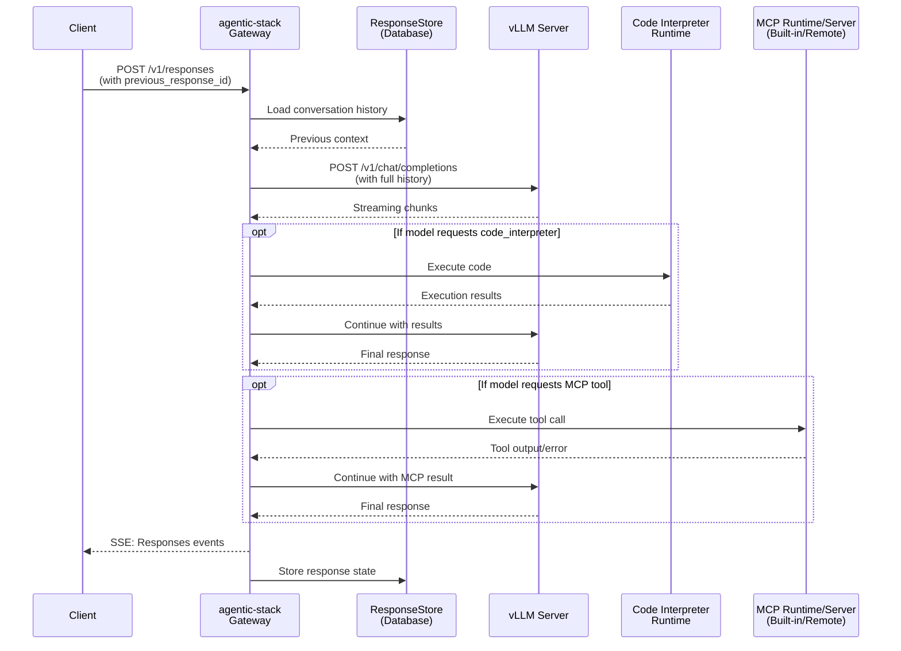

# RFC-01 — Project Structure

> **Status:** Draft — open for community review
> **Component:** Repository layout, package structure, module organization
> **Relates to:** RFC-02 (gateway & protocol translation)

---

## 1. What This RFC Covers

This RFC proposes the full structure of the `agentic-stack` Python package — from the top-level repository down to individual modules. The goal is to give the community a clear map before we discuss implementation details in later RFCs.

---

## 2. System Overview

`agentic-stack` is a gateway that sits between client applications and a vLLM inference server. It adds statefulness, built-in tool execution, MCP integration, and spec-compliant streaming on top of vLLM's Chat Completions API.



Each participant in this diagram maps to an RFC:

```
ResponseStore (DB)         → RFC-02
Gateway (translation)      → RFC-03
Code Interpreter Runtime   → RFC-04
MCP Runtime/Server         → RFC-05
Config & Infrastructure    → RFC-06
```

---

---

## 3. Top-Level Repository Layout

```
agentic-stack/
│
├── agentic_stack/          ← Python package (all source lives here)
│
├── tests/                  ← test suite
├── docs/                   ← user-facing documentation (MkDocs)
├── scripts/                ← CI and build helpers
├── pyproject.toml          ← package manifest, dependencies, extras
└── README.md
```

---

## 4. Package Structure — Full Map

The package is organized into **six layers**, each with a clear responsibility boundary. Outer layers depend on inner ones, never the reverse.

```
agentic_stack/
│
│  ┌─────────────────────────────────────────────────┐
│  │  LAYER 1 — Entry Points & Deployment            │
│  │  How the process starts and how routes attach   │
│  └─────────────────────────────────────────────────┘
│
├── entrypoints/
│   ├── serve.py            `agentic-stack serve` — standalone gateway CLI
│   ├── vllm_cli.py         `agentic-stack vllm` — shim that delegates to vLLM
│   ├── gateway/
│   │   └── _app.py         FastAPI app factory (standalone + integrated)
│   ├── vllm/
│   │   ├── _runtime.py     Integrated mode: patches vLLM build_app at startup
│   │   ├── _adapter.py     vLLM module loader + CLI delegation helpers
│   │   └── _spec.py        IntegratedServeSpec dataclass
│   ├── _serve/
│   │   ├── _runtime.py     Supervisor process launcher (Gunicorn)
│   │   └── _spec.py        ServeSpec dataclass
│   ├── _helper_runtime.py  Sidecar process management (code interpreter, MCP)
│   ├── _state.py           App-level shared state (attached to FastAPI app)
│   ├── _serve_utils.py     Port availability checks, process termination
│   ├── gunicorn_conf.py    Gunicorn worker configuration
│   ├── api.py              Public Python API (programmatic use)
│   └── mcp_runtime.py      MCP runtime process entrypoint
│
│  ┌─────────────────────────────────────────────────┐
│  │  LAYER 2 — HTTP Routing                         │
│  │  FastAPI route handlers, one file per concern   │
│  └─────────────────────────────────────────────────┘
│
├── routers/
│   ├── serving.py          POST /v1/responses
│   │                       GET  /v1/responses/{id}
│   ├── mcp.py              MCP discovery and tool proxy routes
│   └── upstream_proxy.py   Pass-through proxy for all other /v1/* routes
│
│  ┌─────────────────────────────────────────────────┐
│  │  LAYER 3 — Core Request Orchestration           │
│  │  One request in → one response (or SSE stream)  │
│  └─────────────────────────────────────────────────┘
│
├── lm.py                   LMEngine: drives one full request lifecycle
│                           Uses pydantic-ai Agent to call vLLM + run tools
│                           Feeds events into the 3-stage pipeline below
│
├── lm_failures.py          Failure classification, logging, error counters
│
├── responses_core/         The 3-stage event pipeline ← see RFC-02
│   ├── models.py           NormalizedEvent: 22 frozen dataclasses
│   ├── normalizer.py       Stage 1 — pydantic-ai events → NormalizedEvents
│   ├── composer.py         Stage 2 — NormalizedEvents → OpenAI SSE objects
│   ├── sse.py              Stage 3 — SSE objects → raw "data: {...}\n\n" frames
│   └── store.py            ResponseStore: previous_response_id statefulness ← RFC-03
│
│  ┌─────────────────────────────────────────────────┐
│  │  LAYER 4 — Tool Runtimes                        │
│  │  Gateway-executed tools, run inside a request   │
│  └─────────────────────────────────────────────────┘
│
├── tools/
│   ├── ids.py              Tool name constants
│   ├── bootstrap.py        Tool registration at startup
│   ├── runtime.py          ToolRuntimeContext: per-request tool state container
│   ├── profile_resolution.py  Web search profile → adapter resolution
│   │
│   ├── base/               Abstract base types shared by all tools
│   │   ├── config.py
│   │   ├── runtime.py
│   │   └── types.py
│   │
│   ├── code_interpreter/   ← RFC-04
│   │   ├── __init__.py     Python side: spawns and calls the Bun/Pyodide server
│   │   ├── src/            TypeScript source for the Pyodide HTTP server
│   │   │   ├── server.ts
│   │   │   ├── repl.ts
│   │   │   ├── worker.ts
│   │   │   ├── worker-pool.ts
│   │   │   ├── pyodide-manager.ts
│   │   │   └── types.ts
│   │   └── package.json
│   │
│   └── web_search/         ← RFC-04
│       ├── tool.py         Tool definition registered with pydantic-ai
│       ├── executor.py     Search + page fetch orchestration
│       ├── runtime.py      Per-request web search state
│       ├── page_cache.py   Request-local page content cache
│       ├── profiles.py     Profile registry (duckduckgo, exa, fetch…)
│       ├── config.py
│       ├── mcp_provision.py  MCP-backed search provisioning
│       ├── types.py
│       └── adapters/
│           ├── base.py
│           ├── duckduckgo_common.py
│           ├── exa_mcp.py
│           └── fetch_mcp.py
│
│  ┌─────────────────────────────────────────────────┐
│  │  LAYER 5 — MCP Integration                      │
│  │  Model Context Protocol: hosted + remote        │
│  └─────────────────────────────────────────────────┘
│
├── mcp/                    ← RFC-05
│   ├── config.py           MCP config file parsing
│   ├── hosted_registry.py  Built-in MCP server inventory
│   ├── runtime_client.py   HTTP client for the MCP runtime sidecar
│   ├── fastmcp_runtime.py  FastMCP-based runtime process
│   ├── gateway_toolset.py  MCP tools registered as pydantic-ai toolsets
│   ├── runtime_toolset.py  Runtime toolset wiring
│   ├── resolver.py         Tool name → MCP server label resolution
│   ├── policy.py           Authorization and header policy
│   ├── utils.py            Payload parsing, error truncation helpers
│   └── types.py            McpToolRef and related types
│
│  ┌─────────────────────────────────────────────────┐
│  │  LAYER 6 — Config, Types, Infrastructure        │
│  │  Shared foundations used by all layers above    │
│  └─────────────────────────────────────────────────┘
│
├── configs/
│   ├── runtime.py          RuntimeConfig dataclass — all tunables in one place
│   ├── defaults.py         Default values
│   ├── builders.py         Config construction from CLI args + env vars
│   ├── sources.py          EnvSource: typed env var reader
│   ├── startup.py          CLI argument definitions
│   ├── mock_llm.py         Mock LLM backend for testing
│   └── config.json         Static default config values
│
├── types/
│   ├── openai.py           Pydantic models: request, response, output items,
│   │                       tool types, SSE event types
│   └── api.py              UserAgent parser, generic Page / OkResponse models
│
├── observability/
│   ├── metrics.py          Prometheus metrics
│   └── tracing.py          OpenTelemetry span setup
│
├── db.py                   Async DB engine factory (SQLite + Postgres)
│
└── utils/
    ├── cache.py            Redis cache client
    ├── cassette_replay.py  HTTP cassette replay for tests
    ├── crypt.py            Crypto helpers
    ├── dates.py            UTC datetime helpers
    ├── exceptions.py       BadInputError, ResponsesAPIError
    ├── handlers.py         FastAPI exception handlers
    ├── io.py               Async HTTP client factory, JSON helpers
    ├── logging.py          Loguru sink setup
    ├── loguru_otlp_handler.py  OpenTelemetry log handler
    ├── types.py            Shared utility types
    └── urls.py             URL normalization helpers
```

---

## 5. Layer Dependency Rules

```
┌────────────────────────────────────────────────────────────────┐
│                                                                │
│   entrypoints  ──► routers, configs                           │
│   routers      ──► lm, responses_core                         │
│   lm           ──► responses_core, tools, mcp, configs, types │
│   responses_core ──► types, utils                             │
│   tools        ──► configs, types, utils                      │
│   mcp          ──► configs, types, utils                      │
│   configs      ──► utils only                                 │
│   types        ──► (no internal imports)                      │
│   utils        ──► (no internal imports)                      │
│                                                                │
│   Rule: no lower layer may import from a higher layer.        │
│         types and utils are the shared foundation.            │
│                                                                │
└────────────────────────────────────────────────────────────────┘
```

---

## 6. Where Each RFC Goes From Here

```
RFC-02  →  responses_core/  (normalizer, composer, sse) + lm.py
RFC-03  →  responses_core/store.py + db.py + utils/cache.py
RFC-04  →  tools/code_interpreter/ + tools/web_search/
RFC-05  →  mcp/
```

---

## 7. Open Questions for Community Review

**Q1 — Layer 1 size**
`entrypoints/` has grown large supporting both standalone and integrated deployment modes. Should standalone and integrated be split into top-level subpackages (`agentic_stack.standalone`, `agentic_stack.integrated`) to reduce coupling between the two modes?

**Q2 — TypeScript inside a Python package**
`tools/code_interpreter/src/*.ts` ships TypeScript source inside the Python package. Should this live in a separate repository and only be fetched as a compiled binary artifact at build time?

**Q3 — pydantic-ai coupling in `lm.py`**
`lm.py` hard-couples the orchestration layer to pydantic-ai. Should it sit behind an abstract `LLMBackend` interface so the underlying framework can be swapped without touching routing or the event pipeline?
